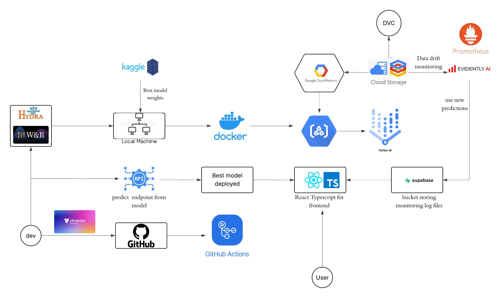

# Brain Tumor Detection

## Introduction
The Brain Tumor Monitoring System is a comprehensive MLOps solution designed to monitor and detect data drift in machine learning models that detect and classify brain tumor images. This system provides real-time monitoring, automated drift detection, and comprehensive reporting capabilities to ensure the reliability and accuracy of medical AI systems.

## Dataset
**Medical Image DataSet: Brain Tumor Detection**<br>
https://www.kaggle.com/datasets/pkdarabi/medical-image-dataset-brain-tumor-detection <br>
The Brain Tumor MRI dataset, curated by Roboflow Universe, is a comprehensive dataset designed for the detection and classification of brain tumors using advanced computer vision techniques. It comprises 3,903 MRI images categorized into four distinct classes:<br>
- Glioma: A tumor originating from glial cells in the brain.
- Meningioma: Tumors arising from the meninges, the protective layers surrounding the brain and spinal cord.
- Pituitary Tumor: Tumors located in the pituitary gland, affecting hormonal balance.
- No Tumor: MRI scans that do not exhibit any tumor presence.
This dataset is structured into:
- Train set: 2144 images(70%)
- Validation set: 612 images(20%)
- Test set: 308 images(10%)

## MLOps pipeline


## Model
**YOLO Model**
real-time object detection system based on CNN

## How to run the web frontend locally

1. **Install dependencies**
   ```sh
   cd frontend
   npm install
   ```

2. **Start the development server**
   ```sh
   npm run dev
   ```

3. **Open your browser** and go to the URL shown in the terminal (usually http://localhost:8080).

The frontend code is located in `frontend/src/`. The entry point is `frontend/src/main.tsx` and the main HTML file is `frontend/src/index.html`.

## How to run the backend API locally

1. **Install dependencies**
   ```sh
   cd backend
   pip install -r requirements.txt
   ```

2. **Start the FastAPI server**
   ```sh
   uvicorn src.api:app --reload --host 0.0.0.0 --port 8000
   ```

The backend entry point is `backend/src/api.py`.

## How to run ML scripts locally

1. **Install ML dependencies**
   ```sh
   cd ml
   pip install -r requirements.txt
   ```

2. **Run training scripts**
   ```sh
   python train.py
   ```

Or you can use command line interface

3. **Install the project again in editable mode**
   ```sh
   pip install -e .
   train
   ```

## How to run sweep for hyperparameter tuning

You can run sweep agent of W&D for hyperparametertuning.

   ```sh
   wandb sweep ml/configs/sweep.yaml
   wandb agent my-username/BrainTumorDetection/sweep id
   ```

## How to run the app with Docker

You can run the full stack application (frontend and backend) using Docker and Docker Compose. This will build and start both the FastAPI backend and the frontend (served with nginx) in separate containers.

### 1. Build and run with Docker Compose

From the project root, run:

```sh
docker-compose up --build
```

- This command will build the images for both the API and frontend using the Dockerfiles in `dockerfiles/api.Dockerfile` and `dockerfiles/frontend.Dockerfile`.
- It will start both services as defined in `docker-compose.yml`.

### 2. Access the app

- **Frontend:** [http://localhost:8080](http://localhost:8080)
- **API:** [http://localhost:8000](http://localhost:8000)

### 3. Stopping the app

To stop the containers, press `Ctrl+C` in the terminal where Docker Compose is running. To remove the containers, run:

```sh
docker-compose down
```

### 4. Notes
- Make sure Docker is installed and running on your system.
- You can modify the Dockerfiles in the `dockerfiles/` directory if you need to customize the build process for the API or frontend.
- The `docker-compose.yml` file orchestrates the services and handles port mapping.


## How to run the app with Docker in Google Cloud

### 1. Build a Docker and push it to Artifact Registry

From the project root, run:

```sh
gcloud builds submit . --config=cloudbuild.yaml
```

### 2. Training on GCP using Vertex AI

```sh
gcloud ai custom-jobs create \
    --region=europe-west1 \
    --display-name=simple-train \
    --config=cloud_run.yaml
gcloud gcloud ai custom-jobs ...
```
Now you can check training status in Vertext AI/Training

## Codebase Folder Structure

```
.
├── backend/           # FastAPI backend API for prediction, patient management, and monitoring endpoints
│   ├── requirements.txt
│   └── src/
│       └── api.py     # Main FastAPI application
├── frontend/          # React + TypeScript frontend dashboard for real-time monitoring and visualization
│   ├── package.json
│   └── src/
│       └── main.tsx   # Frontend entry point
├── ml/                # Machine learning pipeline: training, inference, configs, and utilities
│   ├── requirements.txt
│   ├── train.py       # Model training script
│   ├── predict.py     # Model inference script
│   ├── configs/       # ML and data configuration files
│   └── models.py      # Model definitions
├── monitoring/        # Monitoring engine for drift detection, feature extraction, and reporting
│   ├── requirements.txt
│   ├── core/          # Core monitoring logic (drift detection, feature extraction)
│   ├── api/           # Standalone monitoring API
│   └── reports/       # Generated drift reports
├── tests/             # Unit, integration, and performance tests for all components
│   ├── unittests/
│   ├── integrationtests/
│   └── performance_tests/
├── docs/              # Sphinx documentation source files
├── dockerfiles/       # Dockerfiles for backend, frontend, monitoring, and training services
├── data/              # (Usually empty, managed by DVC; actual data is in cloud or via DVC)
├── reports/           # Project reports and generated artifacts
├── .github/           # GitHub Actions workflows for CI/CD
├── requirements_dev.txt # Development dependencies
├── pyproject.toml     # Python project metadata and build configuration
└── docker-compose.yml # Orchestrates multi-service local development
```

**Key Points:**
- Each microservice (backend, frontend, ml, monitoring) is in its own top-level folder for modularity.
- `docs/` contains all documentation sources (Sphinx).
- `dockerfiles/` holds Docker build instructions for each service.
- `tests/` is organized by test type and covers all major components.
- `data/` is typically managed by DVC and may be empty in the repo.
- `reports/` is for generated reports and artifacts, not code.

A more extensive version of the project description can also be accessed here:
https://minhngnn.github.io/MedView-LMU-MLOps-SoSe25-GroupB/
