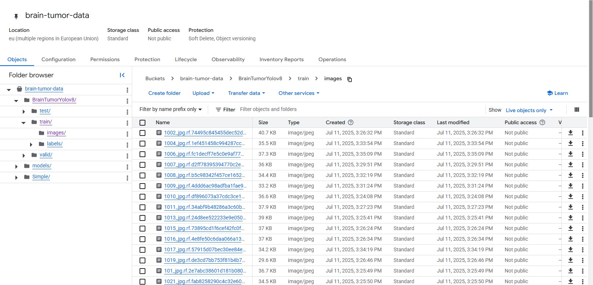
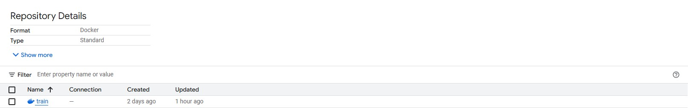

# Exam template for 02476 Machine Learning Operations

This is the report template for the exam. Please only remove the text formatted as with three dashes in front and behind
like:

```--- question 1 fill here ---```

Where you instead should add your answers. Any other changes may have unwanted consequences when your report is
auto-generated at the end of the course. For questions where you are asked to include images, start by adding the image
to the `figures` subfolder (please only use `.JPG`, `.jpg` or `.jpeg`) and then add the following code in your answer:

``

In addition to this markdown file, we also provide the `report.py` script that provides two utility functions:

Running:

```bash
python report.py html
```

Will generate a `.html` page of your report. After the deadline for answering this template, we will auto-scrape
everything in this `reports` folder and then use this utility to generate a `.html` page that will be your serve
as your final hand-in.

Running

```bash
python report.py check
```

Will check your answers in this template against the constraints listed for each question e.g. is your answer too
short, too long, or have you included an image when asked. For both functions to work you mustn't rename anything.
The script has two dependencies that can be installed with

```bash
pip install typer markdown
```

## Overall project checklist

The checklist is *exhaustive* which means that it includes everything that you could do on the project included in the
curriculum in this course. Therefore, we do not expect at all that you have checked all boxes at the end of the project.
The parenthesis at the end indicates what module the bullet point is related to. Please be honest in your answers, we
will check the repositories and the code to verify your answers.

### Week 1

* [x] Create a git repository (M5)
* [x] Make sure that all team members have write access to the GitHub repository (M5)
* [ ] Create a dedicated environment for you project to keep track of your packages (M2)
* [ ] Create the initial file structure using cookiecutter with an appropriate template (M6)
* [ ] Fill out the `data.py` file such that it downloads whatever data you need and preprocesses it (if necessary) (M6)
* [ ] Add a model to `model.py` and a training procedure to `train.py` and get that running (M6)
* [ ] Remember to fill out the `requirements.txt` and `requirements_dev.txt` file with whatever dependencies that you
    are using (M2+M6)
* [ ] Remember to comply with good coding practices (`pep8`) while doing the project (M7)
* [ ] Do a bit of code typing and remember to document essential parts of your code (M7)
* [ ] Setup version control for your data or part of your data (M8)
* [ ] Add command line interfaces and project commands to your code where it makes sense (M9)
* [ ] Construct one or multiple docker files for your code (M10)
* [ ] Build the docker files locally and make sure they work as intended (M10)
* [ ] Write one or multiple configurations files for your experiments (M11)
* [ ] Used Hydra to load the configurations and manage your hyperparameters (M11)
* [ ] Use profiling to optimize your code (M12)
* [ ] Use logging to log important events in your code (M14)
* [ ] Use Weights & Biases to log training progress and other important metrics/artifacts in your code (M14)
* [ ] Consider running a hyperparameter optimization sweep (M14)
* [ ] Use PyTorch-lightning (if applicable) to reduce the amount of boilerplate in your code (M15)

### Week 2

* [ ] Write unit tests related to the data part of your code (M16)
* [ ] Write unit tests related to model construction and or model training (M16)
* [ ] Calculate the code coverage (M16)
* [ ] Get some continuous integration running on the GitHub repository (M17)
* [ ] Add caching and multi-os/python/pytorch testing to your continuous integration (M17)
* [ ] Add a linting step to your continuous integration (M17)
* [ ] Add pre-commit hooks to your version control setup (M18)
* [ ] Add a continues workflow that triggers when data changes (M19)
* [ ] Add a continues workflow that triggers when changes to the model registry is made (M19)
* [ ] Create a data storage in GCP Bucket for your data and link this with your data version control setup (M21)
* [ ] Create a trigger workflow for automatically building your docker images (M21)
* [ ] Get your model training in GCP using either the Engine or Vertex AI (M21)
* [ ] Create a FastAPI application that can do inference using your model (M22)
* [ ] Deploy your model in GCP using either Functions or Run as the backend (M23)
* [ ] Write API tests for your application and setup continues integration for these (M24)
* [ ] Load test your application (M24)
* [ ] Create a more specialized ML-deployment API using either ONNX or BentoML, or both (M25)
* [ ] Create a frontend for your API (M26)

### Week 3

* [ ] Check how robust your model is towards data drifting (M27)
* [ ] Deploy to the cloud a drift detection API (M27)
* [ ] Instrument your API with a couple of system metrics (M28)
* [ ] Setup cloud monitoring of your instrumented application (M28)
* [ ] Create one or more alert systems in GCP to alert you if your app is not behaving correctly (M28)
* [ ] If applicable, optimize the performance of your data loading using distributed data loading (M29)
* [ ] If applicable, optimize the performance of your training pipeline by using distributed training (M30)
* [ ] Play around with quantization, compilation and pruning for you trained models to increase inference speed (M31)

### Extra

* [ ] Write some documentation for your application (M32)
* [ ] Publish the documentation to GitHub Pages (M32)
* [ ] Revisit your initial project description. Did the project turn out as you wanted?
* [ ] Create an architectural diagram over your MLOps pipeline
* [ ] Make sure all group members have an understanding about all parts of the project
* [ ] Uploaded all your code to GitHub

## Group information

### Question 1
> **Enter the group number you signed up on <learn.inside.dtu.dk>**
>
> Answer:

--- question 1 fill here ---

### Question 2
> **Enter the study number for each member in the group**
>
> Example:
>
> *sXXXXXX, sXXXXXX, sXXXXXX*
>
> Answer:

- Minh Nguyen: 13018310
- Euna Goo: 12957195


### Question 3 (Euna)
> **A requirement to the project is that you include a third-party package not covered in the course. What framework**
> **did you choose to work with and did it help you complete the project?**
>
> Recommended answer length: 100-200 words.
>
> Example:
> *We used the third-party framework ... in our project. We used functionality ... and functionality ... from the*
> *package to do ... and ... in our project*.
>
> Answer:

We used the third-party framework 'Ultralytics' in our project for Brain Tumor detection using the YOLO model. The Ultralytics package provides a user-friendly interface and tools for implementing object detection YOLO models with minimal setup. We used the functionality for loading pretrained YOLOv8 models, which allowed us to fine-tune the model on our custom dataset of Brain Tumor scan. Additionally, we leveraged built-in training and validation tools offered by the package to evaluate model performance and adjust hyperparameters efficiently. This significantly accelerated the development process and helped us achieve accurate detection of brain tumors in medical images. Overall, the Ultralytics framework was essential to our project, as it provided a powerful and flexible foundation for applying deep learning techniques to a real-world medical imaging task.


## Coding environment

> In the following section we are interested in learning more about you local development environment. This includes
> how you managed dependencies, the structure of your code and how you managed code quality.

### Question 4 (Theerdha)

> **Explain how you managed dependencies in your project? Explain the process a new team member would have to go**
> **through to get an exact copy of your environment.**
>
> Recommended answer length: 100-200 words
>
> Example:
> *We used ... for managing our dependencies. The list of dependencies was auto-generated using ... . To get a*
> *complete copy of our development environment, one would have to run the following commands*
>
> Answer:

--- question 4 fill here ---

### Question 5 (Minh)

> **We expect that you initialized your project using the cookiecutter template. Explain the overall structure of your**
> **code. What did you fill out? Did you deviate from the template in some way?**
>
> Recommended answer length: 100-200 words
>
> Example:
> *From the cookiecutter template we have filled out the ... , ... and ... folder. We have removed the ... folder*
> *because we did not use any ... in our project. We have added an ... folder that contains ... for running our*
> *experiments.*
>
> Answer:

From the cookiecutter template, we set up essential files and folders such as `.gitignore`, `pyproject.toml`, `docs`, `dockerfiles`, `.github`, and `tests` to ensure good project hygiene, documentation, containerization, and CI/CD support. However, we deviated from the standard template by restructuring the project into a monorepo, organizing the codebase into separate top-level folders for each microservice: `backend`, `frontend`, `ml`, and `monitoring`. This means our repository contains all services in a single place (monorepo), while each service is developed as an independent component (microservice architecture). This structure allows each service to be developed, tested, and deployed independently, while sharing a single repository for easier management and collaboration. It supports scalability and modularity, making it easier for our team to work on different parts of the system simultaneously.


### Question 6 (Minh)

> **Did you implement any rules for code quality and format? What about typing and documentation? Additionally,**
> **explain with your own words why these concepts matters in larger projects.**
>
> Recommended answer length: 100-200 words.
>
> Example:
> *We used ... for linting and ... for formatting. We also used ... for typing and ... for documentation. These*
> *concepts are important in larger projects because ... . For example, typing ...*
>
> Answer:

--- question 6 fill here ---

## Version control

> In the following section we are interested in how version control was used in your project during development to
> corporate and increase the quality of your code.

### Question 7

> **How many tests did you implement and what are they testing in your code?** (Theerdha, Minh)
>
> Recommended answer length: 50-100 words.
>
> Example:
> *In total we have implemented X tests. Primarily we are testing ... and ... as these the most critical parts of our*
> *application but also ... .*
>
> Answer:

--- question 7 fill here ---

### Question 8 (Theerdha)

> **What is the total code coverage (in percentage) of your code? If your code had a code coverage of 100% (or close**
> **to), would you still trust it to be error free? Explain you reasoning.**
>
> Recommended answer length: 100-200 words.
>
> Example:
> *The total code coverage of code is X%, which includes all our source code. We are far from 100% coverage of our **
> *code and even if we were then...*
>
> Answer:

--- question 8 fill here ---

### Question 9 (Euna)

> **Did you workflow include using branches and pull requests? If yes, explain how. If not, explain how branches and**
> **pull request can help improve version control.**
>
> Recommended answer length: 100-200 words.
>
> Example:
> *We made use of both branches and PRs in our project. In our group, each member had an branch that they worked on in*
> *addition to the main branch. To merge code we ...*
>
> Answer:

Yes, our workflow included using branches and pull requests to manage version control effectively. We created several branches, each assigned to specific tasks such as cloud integration, command-line interface development, API implementation, and so on. Each team member worked independently on their assigned branch, allowing parallel development without interfering with the main codebase. Once a task was completed, the developer created a pull request to merge their changes into the main branch. The rest of the team then read that pull request, checking what was processed in the branch, examining code changes, and ensuring non-confliction. During this review, any conflicts or issues were identified and resolved collaboratively. This process helped maintain a clean and stable main branch, improved code quality through peer reviews, and minimized integration problems.


### Question 10 (Minh)

> **Did you use DVC for managing data in your project? If yes, then how did it improve your project to have version**
> **control of your data. If no, explain a case where it would be beneficial to have version control of your data.**
>
> Recommended answer length: 100-200 words.
>
> Example:
> *We did make use of DVC in the following way: ... . In the end it helped us in ... for controlling ... part of our*
> *pipeline*
>
> Answer:

We used DVC (Data Version Control) in our project to manage our datasets and connected it to a Google Cloud Platform (GCP) bucket for remote storage. By integrating DVC, we were able to version control large data files and track changes efficiently, similar to how git tracks code. The connection to a GCP bucket allowed us to store and share data remotely, making it easy for all team members to access the same datasets regardless of their local environment. This setup improved collaboration, ensured data consistency, and made our experiments reproducible, as each experiment could be linked to a specific version of the data stored in the cloud. Overall, using DVC with a GCP bucket streamlined our workflow and provided transparency and reliability in handling data throughout the project pipeline.


### Question 11 (Theerdha)

> **Discuss you continuous integration setup. What kind of continuous integration are you running (unittesting,**
> **linting, etc.)? Do you test multiple operating systems, Python  version etc. Do you make use of caching? Feel free**
> **to insert a link to one of your GitHub actions workflow.**
>
> Recommended answer length: 200-300 words.
>
> Example:
> *We have organized our continuous integration into 3 separate files: one for doing ..., one for running ... testing*
> *and one for running ... . In particular for our ..., we used ... .An example of a triggered workflow can be seen*
> *here: <weblink>*
>
> Answer:

--- question 11 fill here ---

## Running code and tracking experiments

> In the following section we are interested in learning more about the experimental setup for running your code and
> especially the reproducibility of your experiments.

### Question 12 (Euna)

> **How did you configure experiments? Did you make use of config files? Explain with coding examples of how you would**
> **run a experiment.**
>
> Recommended answer length: 50-100 words.
>
> Example:
> *We used a simple argparser, that worked in the following way: Python  my_script.py --lr 1e-3 --batch_size 25*
>
> Answer:

Yes, we made a config.yaml file in the following structure:<br>
```
|--ml
|  |--configs
|     |--model
|     	 |--config.yaml
|     	 |--config_cloud.yaml
|     |--data_config
|     	 |--data.yaml
|     	 |--data_cloud.yaml
|--train.py
```
In the train.py, we used a hydra library to call hyperparameter setting written in configs/model/config.yaml file. There are 4 hyperparameters in the config.yaml file, and hydra calls those parameters. In this way, we can edit hyperparameters easily without editing a train.py file directly.


### Question 13 (Euna)

> **Reproducibility of experiments are important. Related to the last question, how did you secure that no information**
> **is lost when running experiments and that your experiments are reproducible?**
>
> Recommended answer length: 100-200 words.
>
> Example:
> *We made use of config files. Whenever an experiment is run the following happens: ... . To reproduce an experiment*
> *one would have to do ...*
>
> Answer:

To ensure our experiments were reproducible and no information was lost, we used a config.yaml file to store all key hyperparameters and settings of our model. This file included values such as learning rate, batch size, number of epochs, model type. Whenever an experiment was run, the script automatically read from the config.yaml file to apply consistent configurations throughout training and evaluation. This made it easy to keep track of experiment setups and reduced the chance of manual errors. Additionally, we saved model checkpoints and evaluation results for each run. To reproduce an experiment, one simply needs to use the same config.yaml file and run the training script again.


### Question 14 (Euna)

> **Upload 1 to 3 screenshots that show the experiments that you have done in W&B (or another experiment tracking**
> **service of your choice). This may include loss graphs, logged images, hyperparameter sweeps etc. You can take**
> **inspiration from [this figure](figures/wandb.JPG). Explain what metrics you are tracking and why they are**
> **important.**
>
> Recommended answer length: 200-300 words + 1 to 3 screenshots.
>
> Example:
> *As seen in the first image when have tracked ... and ... which both inform us about ... in our experiments.*
> *As seen in the second image we are also tracking ... and ...*
>
> Answer:

Because of training environment, it was impossible to train with a large dataset and large epoch. You can see the result of training with simple subset of data and only 10 epochs. Therefore, the model was not trained well and the model couldn't predict detection.


In the first image you can see tracking of key metrics such as precision, recall, and mAP (mean Average Precision) over training epochs. Precision and recall provide insight into the model’s ability to correctly detect tumors without generating too many false positives or negatives, while mAP gives an overall measure of detection accuracy across various confidence thresholds.


In the second image, you can see that at each epoch, predictions was made and it was drawn with ground truth labels. This visual feedback helped us qualitatively assess how well the model was identifying tumors on unseen MRI scans. It allowed us to spot cases where the model either missed a tumor or incorrectly flagged a non-tumor region.


In third image, it shows the loss curves from multiple hyperparameter sweep runs, each representing a different configuration. We monitored distribution focal loss, classification loss and box regression loss to understand how different settings impacted convergence and model stability. In this case, it looks like that tough-sweep-7 setting is performing the best.


### Question 15 (Theerdha)

> **Docker is an important tool for creating containerized applications. Explain how you used docker in your**
> **experiments/project? Include how you would run your docker images and include a link to one of your docker files.**
>
> Recommended answer length: 100-200 words.
>
> Example:
> *For our project we developed several images: one for training, inference and deployment. For example to run the*
> *training docker image: `docker run trainer:latest lr=1e-3 batch_size=64`. Link to docker file: <weblink>*
>
> Answer:

--- question 15 fill here ---

### Question 16 (Minh)

> **When running into bugs while trying to run your experiments, how did you perform debugging? Additionally, did you**
> **try to profile your code or do you think it is already perfect?**
>
> Recommended answer length: 100-200 words.
>
> Example:
> *Debugging method was dependent on group member. Some just used ... and others used ... . We did a single profiling*
> *run of our main code at some point that showed ...*
>
> Answer:

For debugging, we primarily use the Python debugger, which allows us to set breakpoints, inspect variables, and step through code to identify where things deviate from our expectations. To streamline debugging in our development environment, we also configure a `launch.json` file to ensure the correct Python path is set, making it easier to start debugging sessions directly from our IDE. For small or quick bugs, we often rely on simple logging or printing to the terminal to quickly check values or program flow. When deeper inspection is needed, the debugger is invaluable for examining the state of the application in detail.

Regarding profiling, we mainly focused on profiling the prediction and training steps of our machine learning model. However, since our model is based on a pre-trained YOLO implementation from Ultralytics, most of the heavy lifting is handled by the external library. As a result, profiling mainly showed the import and execution of these library functions, and we did not identify significant custom bottlenecks in our own code.


### Question 17 (Euna, MInh)

> **List all the GCP services that you made use of in your project and shortly explain what each service does?**
>
> Recommended answer length: 50-200 words.
>
> Example:
> *We used the following two services: Engine and Bucket. Engine is used for... and Bucket is used for...*
>
> Answer:

- API Gateway (apigateway.googleapis.com) – This service was used to expose our model as a secure and scalable API endpoint, allowing users to send requests and receive predictions.

- Service Management (servicemanagement.googleapis.com) – This handled the configuration and deployment of managed services, ensuring that our APIs were properly registered and discoverable.

- Service Control (servicecontrol.googleapis.com) – Used for managing access control, logging, and monitoring of our API usage, helping us keep track of service reliability and performance.

- Artifact Registry (artifactregistry.googleapis.com) – This was used to store and manage our Docker container images securely, which we later deployed on GCP.

- Cloud Build (cloudbuild.googleapis.com) – Cloud Build automated the process of building and packaging our code into Docker images, streamlining continuous integration.

- AI Platform (aiplatform.googleapis.com) – We used this service to deploy and manage our trained machine learning model in a production-ready environment with scalable infrastructure.


### Question 18 (Euna)

> **The backbone of GCP is the Compute engine. Explained how you made use of this service and what type of VMs**
> **you used?**
>
> Recommended answer length: 100-200 words.
>
> Example:
> *We used the compute engine to run our ... . We used instances with the following hardware: ... and we started the*
> *using a custom container: ...*
>
> Answer:

We used the Compute Engine to run our brain tumor detection model and support various backend services during development and testing. Specifically, we used a virtual machine with the type n1-standard-1, which provides 1 vCPU. This configuration was sufficient for lightweight tasks such as hosting our API and performing model inference on smaller test inputs.
We started the VM using a custom Docker container, which included our trained YOLO model, necessary dependencies, and scripts for handling prediction requests. Using Compute Engine allowed us to have full control over the runtime environment and scale resources when needed.


### Question 19 (Euna)

> **Insert 1-2 images of your GCP bucket, such that we can see what data you have stored in it.**
> **You can take inspiration from [this figure](figures/bucket.JPG).**
>
> Answer:




### Question 20 (Euna, Minh)

> **Upload 1-2 images of your GCP artifact registry, such that we can see the different docker images that you have**
> **stored. You can take inspiration from [this figure](figures/registry.JPG).**
>
> Answer:



```
|--train-registry/
|  |--train: docker image to run train_cloud.py code
|  |--distributed
```


### Question 21 (Euna, Minh)

> **Upload 1-2 images of your GCP cloud build history, so we can see the history of the images that have been build in**
> **your project. You can take inspiration from [this figure](figures/build.JPG).**
>
> Answer:


### Question 22 (..)

> **Did you manage to train your model in the cloud using either the Engine or Vertex AI? If yes, explain how you did**
> **it. If not, describe why.**
>
> Recommended answer length: 100-200 words.
>
> Example:
> *We managed to train our model in the cloud using the Engine. We did this by ... . The reason we choose the Engine*
> *was because ...*
>
> Answer:

No, we didn't use cloud to train our model. Our model is composed with very large weights and parameters and used large image dataset, which requires GPU for training. However, it was impossible to use GPU server in GCP. Therefore, we used kaggle notebook instead, where we can use free GPU for limited amount. After training the model in the kaggle notebook, we downloaded the best weights file(.pt) and put it in our repository.<br>
Link to kaggle notebook: https://www.kaggle.com/code/eunai9/brain-tumor-detection-with-yolov8-de6d81<br>

But at least, we made a setting to train the model using Vertex AI. In order to confirm if it works well, we create a small subset of data named 'Simple'.


## Deployment

### Question 23 (Minh)

> **Did you manage to write an API for your model? If yes, explain how you did it and if you did anything special. If**
> **not, explain how you would do it.**
>
> Recommended answer length: 100-200 words.
>
> Example:
> *We did manage to write an API for our model. We used FastAPI to do this. We did this by ... . We also added ...*
> *to the API to make it more ...*
>
> Answer:

Yes, we managed to write an API for our model and related services. The API includes endpoints for interacting with a tabular database of patients, allowing users to retrieve a list of all patients or fetch details for a specific patient by ID. Due to the scope of the project, we have currently implemented only the read (GET) endpoints for the patient database, but the structure allows for easy extension to full CRUD (Create, Read, Update, Delete) operations in the future.

In addition to the database endpoints, we implemented a `predict` endpoint that calls the model's prediction function. This endpoint accepts an input image, runs the prediction using our machine learning model, and returns the annotated image with the prediction results overlaid. This makes it easy for users to visualize the model's output directly.

We also included a router for the monitoring system, which is designed to support system health checks and future monitoring features. Overall, the API is modular and organized, making it straightforward to extend with additional endpoints or features as the project evolves.


### Question 24 (Minh)

> **Did you manage to deploy your API, either in locally or cloud? If not, describe why. If yes, describe how and**
> **preferably how you invoke your deployed service?**
>
> Recommended answer length: 100-200 words.
>
> Example:
> *For deployment we wrapped our model into application using ... . We first tried locally serving the model, which*
> *worked. Afterwards we deployed it in the cloud, using ... . To invoke the service an user would call*
> *`curl -X POST -F "file=@file.json"<weburl>`*
>
> Answer:

--- question 24 fill here ---

### Question 25 (Minh)

> **Did you perform any unit testing and load testing of your API? If yes, explain how you did it and what results for**
> **the load testing did you get. If not, explain how you would do it.**
>
> Recommended answer length: 100-200 words.
>
> Example:
> *For unit testing we used ... and for load testing we used ... . The results of the load testing showed that ...*
> *before the service crashed.*
>
> Answer:

Yes, we performed both integration and load testing of our API. For integration testing, we created a suite of tests in the `tests/integrationtests/` folder that cover key API endpoints such as `/patients`, `/patients/{id}`, and `/predict`. These tests verify that the endpoints return correct responses, handle edge cases, and maintain stability as the codebase evolves.

For load testing, we used Locust to simulate multiple users interacting with the API concurrently. Our load test script downloads a random image from a GCP bucket and sends it to the `/predict` endpoint, as well as tests the `/patients` endpoint and error handling by sending invalid files. The results showed that our API could handle multiple simultaneous requests without significant slowdowns or failures, and that error handling worked as intended for invalid inputs. Overall, these tests gave us confidence in the reliability and scalability of our API under realistic usage scenarios.


### Question 26 (Minh)

> **Did you manage to implement monitoring of your deployed model? If yes, explain how it works. If not, explain how**
> **monitoring would help the longevity of your application.**
>
> Recommended answer length: 100-200 words.
>
> Example:
> *We did not manage to implement monitoring. We would like to have monitoring implemented such that over time we could*
> *measure ... and ... that would inform us about this ... behaviour of our application.*
>
> Answer:

Yes, we implemented a comprehensive monitoring system for our deployed model. When the monitoring app is initialized, it uses the first 50 images from the training dataset stored in our GCP bucket as the reference dataset for drift detection. Each time a new prediction is made, the input image and its extracted features are logged to an external database, which in our case is Supabase. This allows us to track all predictions and monitor for data drift over time.

We also developed a UI for the monitoring system. When a user presses the 'Generate Report' button in the UI, the backend generates a drift report by comparing the current data (recent predictions) to the reference data. This report is generated as an HTML file using Evidently and is then stored in a Supabase bucket for easy access and sharing. The UI can then display the generated report directly to users, providing clear visualizations of data drift and model performance. This setup ensures that our monitoring is automated, transparent, and accessible to all stakeholders.


## Overall discussion of project

> In the following section we would like you to think about the general structure of your project.

### Question 27 (Euna)

> **How many credits did you end up using during the project and what service was most expensive? In general what do**
> **you think about working in the cloud?**
>
> Recommended answer length: 100-200 words.
>
> Example:
> *Group member 1 used ..., Group member 2 used ..., in total ... credits was spend during development. The service*
> *costing the most was ... due to ... . Working in the cloud was ...*
>
> Answer:

--- question 27 fill here ---

### Question 28 (Minh)

> **Did you implement anything extra in your project that is not covered by other questions? Maybe you implemented**
> **a frontend for your API, use extra version control features, a drift detection service, a kubernetes cluster etc.**
> **If yes, explain what you did and why.**
>
> Recommended answer length: 0-200 words.
>
> Example:
> *We implemented a frontend for our API. We did this because we wanted to show the user ... . The frontend was*
> *implemented using ...*
>
> Answer:

For the frontend, we chose to use React with TypeScript. This combination allows us to build a more scalable and maintainable user interface, following modern best practices in frontend development. TypeScript provides type safety and better tooling, which helps prevent bugs and makes the codebase easier to manage as the project grows.

For data storage, we use Supabase to handle tabular patient data. This choice was made to create a more comprehensive system where doctors and users can easily scroll through and access patient records via the UI. Additionally, we store the generated monitoring reports (HTML files from Evidently) in Supabase buckets. This makes it straightforward to retrieve and display these reports directly in the frontend, ensuring that monitoring insights are easily accessible to users.

For documentation, we used Sphinx, as it is one of the most popular and feature-rich documentation generators in the Python ecosystem. We wanted to try a robust tool that could handle the extra requirements of the project and provide professional-quality documentation. After generating the documentation with Sphinx, we uploaded it to GitHub Pages to make it easily accessible and shareable with all stakeholders.


### Question 29 (Theerdha)

> **Include a figure that describes the overall architecture of your system and what services that you make use of.**
> **You can take inspiration from [this figure](figures/overview.JPG). Additionally, in your own words, explain the**
> **overall steps in figure.**
>
> Recommended answer length: 200-400 words
>
> Example:
>
> *The starting point of the diagram is our local setup, where we integrated ... and ... and ... into our code.*
> *Whenever we commit code and push to GitHub, it auto triggers ... and ... . From there the diagram shows ...*
>
> Answer:

--- question 29 fill here ---

### Question 30

> **Discuss the overall struggles of the project. Where did you spend most time and what did you do to overcome these**
> **challenges?**
>
> Recommended answer length: 200-400 words.
>
> Example:
> *The biggest challenges in the project was using ... tool to do ... . The reason for this was ...*
>
> Answer:

--- question 30 fill here ---

### Question 31 (All)

> **State the individual contributions of each team member. This is required information from DTU, because we need to**
> **make sure all members contributed actively to the project. Additionally, state if/how you have used generative AI**
> **tools in your project.**
>
> Recommended answer length: 50-300 words.
>
> Example:
> *Student sXXXXXX was in charge of developing of setting up the initial cookie cutter project and developing of the*
> *docker containers for training our applications.*
> *Student sXXXXXX was in charge of training our models in the cloud and deploying them afterwards.*
> *All members contributed to code by...*
> *We have used ChatGPT to help debug our code. Additionally, we used GitHub Copilot to help write some of our code.*
> Answer:

---Answer here---
